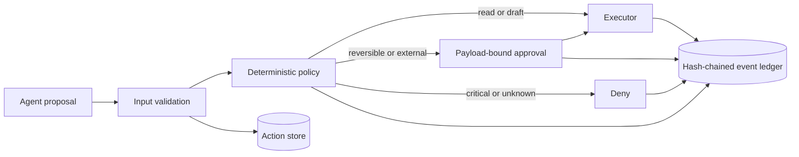

# Verifiable Agent Runtime

A compact reference implementation for letting AI agents **propose actions
without silently acquiring authority**.

The runtime evaluates each tool call against deterministic policy, binds human
approval to the exact payload hash, enforces idempotency, supports shadow and
kill-switch modes, and records every decision in a tamper-evident event chain.
The included executor is intentionally synthetic: the project demonstrates the
control plane, not access to a real external system.

## Why this exists

LLM demos usually optimize the happy path. Production systems also need an
answer to four less glamorous questions:

1. Was this action allowed?
2. Did the approver review this exact payload?
3. Can a retry create the side effect twice?
4. Can an investigator reconstruct what happened later?

This repository makes those answers executable and testable.

## Architecture



## Risk model

| Tier | Example tool | Behavior in live mode |
|---|---|---|
| Read | `knowledge.search` | Execute automatically |
| Propose | `draft.generate` | Execute automatically; no side effect |
| Reversible | `ticket.create` | Require payload-bound approval |
| External | `message.send` | Require payload-bound approval |
| Critical | `record.delete` | Deny |
| Unknown | any unregistered tool | Deny by default |

`shadow` is the default mode: it records what would happen without executing.
`off` is the kill switch. Set `AGENT_RUNTIME_MODE=live` only in a controlled
demo.

## Run locally

Requires Python 3.12 or newer.

```bash
make install
AGENT_RUNTIME_MODE=live make run
```

Open [http://127.0.0.1:8000/docs](http://127.0.0.1:8000/docs) for the generated
OpenAPI interface.

### Propose a read-only action

```bash
curl -sS http://127.0.0.1:8000/v1/actions \
  -H 'content-type: application/json' \
  -d '{
    "tool": "knowledge.search",
    "payload": {"query": "public documentation", "limit": 3},
    "idempotency_key": "demo-read-001"
  }'
```

### Propose and approve an external action

```bash
curl -sS http://127.0.0.1:8000/v1/actions \
  -H 'content-type: application/json' \
  -d '{
    "tool": "message.send",
    "payload": {"channel": "demo", "text": "Synthetic message"},
    "idempotency_key": "demo-message-001"
  }'
```

Copy the returned `id` and `payload_hash`, then approve that exact payload:

```bash
curl -sS http://127.0.0.1:8000/v1/actions/ACTION_ID/approve \
  -H 'content-type: application/json' \
  -d '{"approver":"Demo Reviewer","payload_hash":"PAYLOAD_HASH"}'
```

Verify the ledger at `GET /v1/actions/ACTION_ID/verify`.

## Quality gates

```bash
make check
```

The suite covers automatic execution, approval binding, replay safety,
fail-closed policy, shadow mode, kill switch, and tamper detection. CI runs
formatting, linting, strict type checking, and tests.

## Deployment examples

- `Dockerfile`: digest-pinned base image and non-root process with a `/data` work directory.
- `compose.yaml`: persistent `/data` volume, read-only filesystem, dropped privilege escalation,
  and shadow mode.
- `deploy/kubernetes/`: health probes, resource limits, non-root security context.

The Kubernetes manifest uses ephemeral storage for demonstration. Replace it
with a durable database before any real deployment.

## Scope and limitations

- The executor returns a deterministic synthetic result; it does not contact external services.
- SQLite keeps the demo easy to run. A multi-replica deployment needs a transactional shared store.
- The event hash chain detects mutation; it does not prevent an administrator from replacing the database.
- Authentication, authorization, rate limiting, and a real approval identity provider are intentionally out of scope for v0.1.

See [the threat model](docs/threat-model.md) and
[ADR-0001](docs/adr/0001-tamper-evident-ledger.md) for the design boundaries.
